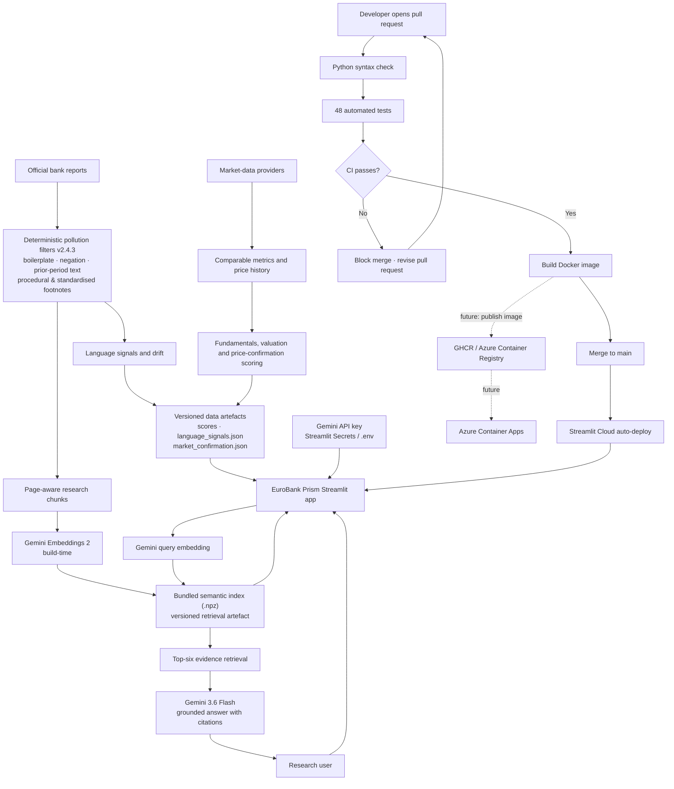

# EuroBank Prism

[](https://github.com/fan-gu/EuroBank-Prism/actions/workflows/ci.yml)

**Evidence-traceable research across fundamentals, management language and price momentum for the 23-bank EURO STOXX Banks universe.**

[Open the live dashboard](https://eurobank-prism.streamlit.app/) · [Architecture](#research-workflow) · [Verification example](#verification-example-keep-the-financial-signal)


## What it does

EuroBank Prism compares 23 listed European banks using three independent signals.

| Signal | Display | What it measures |
|---|---|---|
| Fundamentals & Valuation | Vertical Axis | Relative P/B, P/E, profitability, yield, and growth |
| Management language | Horizontal Axis | Disclosure tone, commitment, uncertainty, caution, and linguistic drift |
| Price confirmation | Bubble Size | Relative 1-, 3-, and 6-month price momentum plus the 200-day trend |

Bubble colour identifies the bank's deterministic research group. A separate
Gemini semantic-research layer answers natural-language questions from the
indexed official reports and cites the source bank, period and PDF page.

Start with the signal map and six research groups, inspect the opportunity and
verification cards, then use semantic research to explore the supporting reports.
Bank-level score details, official-report links and methodology help users check
the evidence behind each observation.

## My contribution

I am developing EuroBank Prism as an independent financial-research project, defining how bank fundamentals, disclosure language and market prices should be compared and traced back to evidence. I use AI coding assistants to implement and refine the application. The methodology, source provenance, filtering rules and tests document the decisions behind the output.

## Verification example: keep the financial signal

- **Input:** a test passage containing a routine rounding note followed by a statement that net interest income is expected to decline.
- **Expected result:** remove the rounding boilerplate while retaining the financially meaningful statement.
- **Check:** [test_semantic_page_filter_removes_rounding_but_keeps_warning](tests/test_semantic_search.py) asserts both behaviours. The same suite checks retrieval ranking, bank filtering and citation metadata in the generated prompt.
- **Evidence:** [filter-validation notes](docs/validation/language-v2.4.3-expanded-rounding-filter.md) and [CI results](https://github.com/fan-gu/EuroBank-Prism/actions/workflows/ci.yml).
- **Limit:** these checks do not establish the factual correctness of every generated answer or the predictive value of the research signals.

## Research workflow



The index is *bundled* with the deployed repository/container; it is not a
machine-local service in production. Gemini has two distinct roles: embeddings
are built when the index is refreshed, and Gemini 3.6 Flash generates a
grounded answer at query time from the retrieved evidence.

## Evidence and governance

- The universe is fixed to 23 EURO STOXX Banks constituents.
- Standard legal disclaimers and safe-harbour boilerplate are excluded from
  management-language scoring.
- Deterministic v2.4.3 filters mask neutral banking risk labels, deduplicate safe
  document repeats, remove technical restatement notes and routine procedural
  footnotes and standardized rounding notes, and drop—not invert—negated
  negative hits. Every action is auditable.
- Language observations retain the source document, reporting period, page,
  quotation, and document hash.
- Four adjacent comparable periods enable a preliminary drift observation;
  eight periods, human review, and out-of-sample testing are required before a
  drift signal is treated as validated research.
- Missing or non-comparable observations remain missing—they are never inferred.
- Semantic answers cannot change a score or investment group and must cite the
  retrieved official-report evidence; insufficient evidence produces no claim.

[Language-filter validation](docs/validation/language-v2.4.3-expanded-rounding-filter.md) · [Semantic-search design](docs/semantic-research.md)

## Run locally

```powershell
git clone https://github.com/fan-gu/EuroBank-Prism.git
cd EuroBank-Prism
python -m venv .venv
.\.venv\Scripts\Activate.ps1
pip install -r requirements.txt
python -m streamlit run streamlit_app.py
```

Core refresh commands:

```powershell
python build_full_universe.py
python build_market_confirmation.py
python discover_language_reports.py
python download_language_reports.py
python -m app.language_signals
python build_semantic_index.py
```

Set `GEMINI_API_KEY` in a local `.env` file or Streamlit Community Cloud Secrets.
The committed index contains embeddings—not the API key. Never commit secrets.

## Delivery and deployment

GitHub Actions runs the syntax check and 48 automated tests first. The Docker
image build has `needs: test`, so it runs only after they pass. The workflow runs
on pull requests and direct pushes to `main`; the intended release path is PR →
green CI → merge to `main` → Streamlit Community Cloud auto-deploy.

To make that release path mandatory, enable GitHub branch protection for `main`
and require the **Python tests** and **Docker build** checks before merging. The
current CI verifies an image can be built; it does not publish one to a container
registry yet, so Docker Desktop and Azure Container Apps are optional future
deployment targets.

To run the same app as a container, install Docker Desktop and use:

```powershell
docker build -t eurobank-prism .
docker run --rm -p 8501:8501 --env-file .env eurobank-prism
```

Open `http://localhost:8501`. The image contains the application and committed
semantic index; `.env`, local PDFs and report archives are excluded.

## Repository structure

```text
streamlit_app.py             Streamlit entry point
Dockerfile                   Reproducible application container
.github/workflows/ci.yml     Automated tests and Docker build
app/                         Scoring, ingestion, evidence, and visual modules
semantic_*.json / .npz       Filtered corpus metadata and local cosine index
assets/                      Bank logos and README media
evidence/                    Reviewable table evidence
reports/                     Local official-report archive (Git-ignored PDFs)
tests/                       Automated checks
archive/legacy_pilot/        Superseded three-bank prototype
archive/planning/            Historical roadmap material
```

## Disclaimer

EuroBank Prism is an educational research tool, not personalized investment
advice. Verify all observations against the linked official disclosures.
