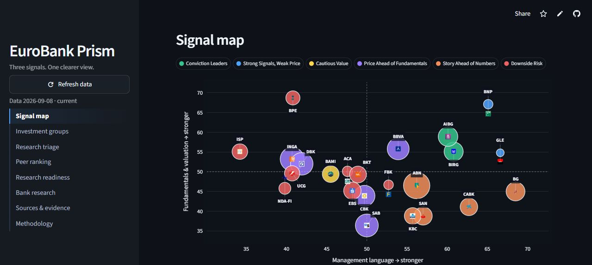

# EuroBank Prism

**A transparent three-signal research screen for the 23 EURO STOXX Banks constituents.**

[Open the live dashboard](https://eurobank-prism.streamlit.app/) · [View the source](https://github.com/fan-gu/EuroBank-Prism)



## What it does

EuroBank Prism compares European banks using three independent signals instead
of blending every observation into one opaque score.

| Signal | Display | What it measures |
|---|---|---|
| Fundamentals & valuation | Vertical position | Relative P/B, P/E, profitability, yield, and growth |
| Management language | Horizontal position | Disclosure tone, commitment, uncertainty, caution, and linguistic drift |
| Price confirmation | Bubble size | Relative 1-, 3-, and 6-month price momentum plus the 200-day trend |

Bubble colour identifies the bank's deterministic research group. The dashboard
also provides a complete peer ranking, bank-level research pages, triage alerts,
official report links, and methodology notes.

## Research workflow

```text
Official reports ──> page-aware extraction ──> language evidence and drift
Market data ───────> comparable metrics ─────> peer-relative fundamentals
Price history ─────> momentum checks ────────> price-confirmation bubble
                               governance gates ──> Streamlit dashboard
```

## Evidence and governance

- The universe is fixed to 23 EURO STOXX Banks constituents.
- Standard legal disclaimers and safe-harbour boilerplate are excluded from
  management-language scoring.
- Language observations retain the source document, reporting period, page,
  quotation, and document hash.
- Four adjacent comparable periods enable a preliminary drift observation;
  eight periods, human review, and out-of-sample testing are required before a
  drift signal is treated as validated research.
- Missing or non-comparable observations remain missing—they are never inferred.

## Run locally

```powershell
python -m venv .venv
.\.venv\Scripts\Activate.ps1
pip install -r requirements.txt
python -m streamlit run streamlit_app.py
```

Core refresh commands:

```powershell
python build_full_universe.py
python build_market_confirmation.py
python discover_language_reports.py
python download_language_reports.py
python -m app.language_signals
```

Keep provider credentials in a local `.env` file. Never commit secrets.

## Repository structure

```text
streamlit_app.py             Streamlit entry point
app/                         Scoring, ingestion, evidence, and visual modules
assets/                      Bank logos and README media
evidence/                    Reviewable table evidence
reports/                     Local official-report archive (Git-ignored PDFs)
tests/                       Automated checks
archive/legacy_pilot/        Superseded three-bank prototype
archive/planning/            Historical roadmap material
```

## Disclaimer

EuroBank Prism is an educational research tool, not personalized investment
advice. Verify all observations against the linked official disclosures.
